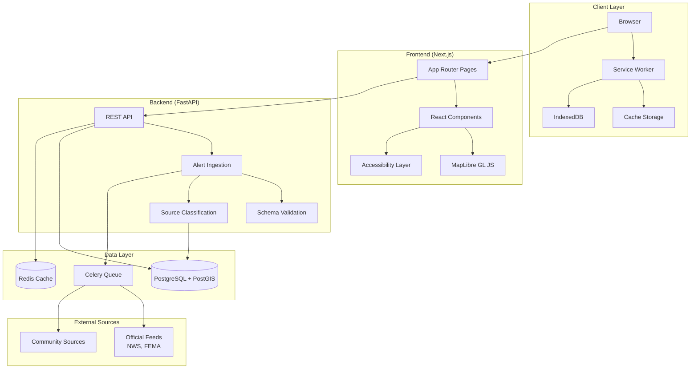

# GeoAlert v2 Transformation - Technical Design

## Overview

### Purpose

GeoAlert v2 transforms the current emergency alert system from a map-centric visualization tool into a **safety-first crisis response platform**. The redesign prioritizes answering six critical questions that determine user safety and action:

1. **Am I in danger?** - Immediate threat assessment
2. **What should I do?** - Clear, actionable guidance
3. **Is this official?** - Source verification and trust
4. **Where exactly?** - Precise geographic context
5. **How current is this?** - Temporal awareness and staleness
6. **What if the internet fails?** - Offline resilience

This transformation addresses fundamental gaps in the current implementation:
- Current system shows raw GeoJSON without safety context
- No source verification or provenance tracking
- Poor accessibility (keyboard navigation, screen readers)
- No offline capability during network disruption
- Missing temporal awareness (alert freshness/staleness)
- Privacy concerns with precise location handling

### Goals

**Primary Goals:**
- **Safety-first UX**: Text-first crisis mode with <100KB payload, progressive map enhancement
- **Universal accessibility**: WCAG 2.2 AA compliance (keyboard, screen reader, 400% zoom)
- **Trust architecture**: Official source classification with multi-layer verification
- **Offline resilience**: Service Worker with staleness detection and local persistence
- **Privacy-first**: No server-side precise location storage by default

**Non-Goals:**
- Custom map tile hosting (use public tiles initially)
- Real-time collaborative features
- Historical alert analytics beyond basic freshness
- Mobile native apps (PWA approach for Phase 1)

### Technical Stack

**Frontend:**
- **Framework**: Next.js 14+ (App Router) with TypeScript
- **Mapping**: MapLibre GL JS v4+ (open-source, Mapbox GL fork)
- **State Management**: React Context + SWR for data fetching
- **Styling**: Tailwind CSS with accessibility utilities
- **Offline**: Service Worker API with Workbox

**Backend:**
- **API Framework**: FastAPI (Python) for high-performance async
- **Database**: PostgreSQL 15+ with PostGIS extension
- **Caching**: Redis for session and query caching
- **Task Queue**: Celery for alert ingestion jobs

**Infrastructure:**
- **Hosting**: Vercel (frontend), Railway/Render (backend)
- **CDN**: Cloudflare for static assets and DDoS protection
- **Monitoring**: Sentry (errors), Plausible (privacy-first analytics)

---

## Architecture

### High-Level Architecture



### Architectural Patterns

**1. Progressive Enhancement**
- **Text-first crisis mode**: <100KB HTML payload with essential alert information
- **Map enhancement**: Load MapLibre and tiles only after critical text content
- **Graceful degradation**: Full functionality without JavaScript (server-rendered)

**2. Offline-First**
- **Service Worker**: Intercept requests, serve cached content when offline
- **IndexedDB**: Store alerts, user preferences, map tiles locally
- **Staleness detection**: Track alert age, mark outdated data visually

**3. Privacy by Design**
- **Local-first location**: Browser geolocation API, no server storage by default
- **Coarse location**: Only city/region sent to server for alert filtering
- **Opt-in precision**: User must explicitly consent to share precise coordinates

**4. Trust Layering**
- **Source classification**: Automated official/community categorization
- **Provenance badges**: Visual indicators with verification details
- **Multi-layer verification**: DNS, HTTPS, domain reputation, DKIM

---

## Components and Interfaces

### Frontend Components

#### 1. Crisis Mode Text View (`/app/crisis/page.tsx`)

**Purpose**: Minimal, text-only alert view for low-bandwidth scenarios (<100KB payload)

**Responsibilities:**
- Server-render alert list with no JavaScript dependencies
- Display safety-critical information: danger level, action guidance, source
- Provide keyboard-accessible navigation
- Link to full map view when bandwidth available

**Props/State:**
```typescript
interface CrisisViewProps {
  alerts: MinimalAlert[];
  userRegion: CoarseLocation;
  lastUpdated: ISO8601Timestamp;
}

interface MinimalAlert {
  id: string;
  severity: 'extreme' | 'severe' | 'moderate' | 'minor';
  event: string;
  headline: string;
  instruction: string;
  source: 'official' | 'community';
  areas: string[];  // Text descriptions: "Downtown Seattle, WA"
  effective: ISO8601Timestamp;
  expires: ISO8601Timestamp;
  isStale: boolean;
}
```

**Key Features:**
- No external resources (inline CSS, no images)
- High contrast colors (WCAG AAA)
- Semantic HTML5 with ARIA landmarks
- Skip links for keyboard navigation

#### 2. Map View Component (`/components/MapView.tsx`)

**Purpose**: Interactive map displaying alerts with geographic precision

**Responsibilities:**
- Initialize MapLibre GL JS with accessible controls
- Render alert polygons with severity-based styling
- Handle user interaction (click, keyboard focus)
- Integrate with AlertDetailsPanel for selection

**Props/State:**
```typescript
interface MapViewProps {
  alerts: GeoJSONFeatureCollection;
  userLocation?: GeographicCoordinates;
  selectedAlertId?: string;
  onAlertSelect: (alertId: string) => void;
  offlineMode: boolean;
}

interface MapViewState {
  mapInstance: maplibregl.Map | null;
  loadedTiles: string[];
  userInteractionMode: 'pan' | 'keyboard-navigate';
}
```

**Accessibility Features:**
- Keyboard controls: Arrow keys (pan), +/- (zoom), Tab (cycle alerts)
- Screen reader announcements for alert selection
- High contrast mode support
- Focus indicators on map features

#### 3. Alert Details Panel (`/components/AlertDetailsPanel.tsx`)

**Purpose**: Display comprehensive alert information for selected alert

**Responsibilities:**
- Show full alert details (description, instructions, source provenance)
- Display temporal information (effective, expires, freshness)
- Render source verification badges
- Provide action buttons (dismiss, share, get directions)

**Props/State:**
```typescript
interface AlertDetailsPanelProps {
  alert: Alert | null;
  onClose: () => void;
  offlineMode: boolean;
}

interface Alert {
  id: string;
  severity: Severity;
  event: string;
  headline: string;
  description: string;
  instruction: string;
  source: SourceProvenance;
  geometry: GeoJSONGeometry;
  effective: ISO8601Timestamp;
  expires: ISO8601Timestamp;
  onset?: ISO8601Timestamp;
  metadata: {
    isStale: boolean;
    ageMinutes: number;
    verificationLevel: 'verified' | 'unverified' | 'suspicious';
  };
}

interface SourceProvenance {
  classification: 'official' | 'community';
  displayName: string;
  url: string;
  verificationDetails: {
    httpsVerified: boolean;
    domainReputation: 'high' | 'medium' | 'low';
    dkimVerified?: boolean;
    listedInOfficialRegistry: boolean;
  };
}
```

**Key Features:**
- Provenance badge with expandable verification details
- Staleness indicator (color-coded: fresh/aging/stale)
- Action guidance prominently displayed
- Responsive layout (modal on mobile, sidebar on desktop)

#### 4. Source Classification Badge (`/components/SourceBadge.tsx`)

**Purpose**: Visual indicator of alert source trustworthiness

**Responsibilities:**
- Display official/community classification
- Show verification level with iconography
- Provide expandable details on click
- Maintain accessibility (alt text, ARIA labels)

**Props/State:**
```typescript
interface SourceBadgeProps {
  source: SourceProvenance;
  size: 'small' | 'medium' | 'large';
  expandable: boolean;
}
```

**Visual Design:**
- **Official**: Blue badge with checkmark icon
- **Community**: Gray badge with info icon
- **Verified**: Green border
- **Unverified**: Yellow border
- **Suspicious**: Red border with warning icon

#### 5. Offline Indicator (`/components/OfflineIndicator.tsx`)

**Purpose**: Notify users of offline mode and data staleness

**Responsibilities:**
- Detect online/offline state
- Display banner when offline
- Show staleness warnings for aged alerts
- Provide "retry sync" button when back online

**Props/State:**
```typescript
interface OfflineIndicatorProps {
  isOnline: boolean;
  lastSyncTime: ISO8601Timestamp | null;
  staleAlertCount: number;
}
```

#### 6. Accessibility Toolbar (`/components/A11yToolbar.tsx`)

**Purpose**: Provide accessibility controls for user customization

**Responsibilities:**
- Toggle high contrast mode
- Adjust text size (up to 400% zoom)
- Enable screen reader optimizations
- Persist preferences to localStorage

**Props/State:**
```typescript
interface A11yToolbarProps {
  preferences: AccessibilityPreferences;
  onPreferencesChange: (prefs: AccessibilityPreferences) => void;
}

interface AccessibilityPreferences {
  highContrast: boolean;
  textScale: 100 | 150 | 200 | 300 | 400;  // Percentage
  screenReaderOptimized: boolean;
  reducedMotion: boolean;
}
```

### Backend API Endpoints

#### 1. GET `/api/alerts`

**Purpose**: Retrieve alerts for specified geographic region

**Query Parameters:**
```typescript
interface AlertQueryParams {
  region?: string;              // Coarse location: "Seattle, WA"
  bbox?: BoundingBox;           // [minLon, minLat, maxLon, maxLat]
  severity?: Severity[];        // Filter by severity levels
  source?: 'official' | 'community' | 'all';
  limit?: number;               // Max results (default: 50)
  offset?: number;              // Pagination offset
  includeExpired?: boolean;     // Include expired alerts (default: false)
}

interface BoundingBox {
  minLon: number;
  minLat: number;
  maxLon: number;
  maxLat: number;
}
```

**Response:**
```typescript
interface AlertsResponse {
  alerts: Alert[];
  metadata: {
    total: number;
    returned: number;
    timestamp: ISO8601Timestamp;
    staleCutoff: ISO8601Timestamp;  // Alerts older than this are stale
  };
}
```

**Behavior:**
- Returns GeoJSON FeatureCollection by default
- Filters alerts by spatial intersection with region/bbox
- Marks alerts as stale if >2 hours old
- Caches responses in Redis (TTL: 5 minutes)

#### 2. GET `/api/alerts/{id}`

**Purpose**: Retrieve detailed information for single alert

**Path Parameters:**
- `id`: Alert unique identifier

**Response:**
```typescript
interface AlertDetailResponse {
  alert: Alert;
  relatedAlerts: Alert[];  // Overlapping or related alerts
  metadata: {
    fetchedAt: ISO8601Timestamp;
    isCached: boolean;
  };
}
```

#### 3. GET `/api/sources`

**Purpose**: Retrieve list of configured alert sources with classification

**Query Parameters:**
```typescript
interface SourceQueryParams {
  classification?: 'official' | 'community';
  status?: 'active' | 'inactive' | 'suspended';
}
```

**Response:**
```typescript
interface SourcesResponse {
  sources: AlertSource[];
  metadata: {
    total: number;
    officialCount: number;
    communityCount: number;
  };
}

interface AlertSource {
  id: string;
  name: string;
  url: string;
  classification: 'official' | 'community';
  verificationLevel: 'verified' | 'unverified' | 'suspicious';
  status: 'active' | 'inactive' | 'suspended';
  lastIngestedAt: ISO8601Timestamp | null;
  errorRate: number;  // Percentage of failed ingestions
  metadata: {
    country?: string;
    region?: string;
    coverage: string[];  // Geographic areas covered
  };
}
```

#### 4. POST `/api/sources/classify`

**Purpose**: Classify a new alert source as official or community

**Request Body:**
```typescript
interface ClassifySourceRequest {
  url: string;
  name?: string;
  providedClassification?: 'official' | 'community';
}
```

**Response:**
```typescript
interface ClassifySourceResponse {
  classification: 'official' | 'community';
  confidence: number;  // 0-1 score
  verificationDetails: {
    httpsVerified: boolean;
    domainReputation: 'high' | 'medium' | 'low';
    listedInOfficialRegistry: boolean;
    registryName?: string;
    manualReviewRequired: boolean;
  };
  reasoning: string[];  // Explanation of classification decision
}
```

**Classification Logic:**
1. Check against official registry (NWS, FEMA, state emergency management)
2. Verify HTTPS and domain reputation
3. Check domain age and registration details
4. Analyze URL patterns (e.g., .gov domains)
5. Return classification with confidence score

#### 5. POST `/api/alerts/ingest`

**Purpose**: Ingest new alerts from external sources (internal endpoint)

**Authentication**: API key required (internal service only)

**Request Body:**
```typescript
interface IngestAlertsRequest {
  sourceId: string;
  alerts: RawAlertData[];
}

interface RawAlertData {
  externalId: string;
  format: 'cap' | 'geojson' | 'custom';
  payload: object;  // Raw alert data in source format
}
```

**Response:**
```typescript
interface IngestAlertsResponse {
  ingested: number;
  updated: number;
  skipped: number;
  errors: {
    alertId: string;
    error: string;
  }[];
  timing: {
    totalMs: number;
    validationMs: number;
    classificationMs: number;
    storageMs: number;
  };
}
```

### Service Worker

#### Purpose
Provide offline functionality and performance optimization through aggressive caching

#### Responsibilities
- Cache static assets (JS, CSS, fonts)
- Cache map tiles for offline viewing
- Store alert data in IndexedDB
- Intercept API requests, serve cached data when offline
- Implement background sync for stale data updates

#### Implementation Strategy

**Caching Strategy:**
```typescript
// Cache-first for static assets
workbox.routing.registerRoute(
  /\.(js|css|woff2|png|svg)$/,
  new workbox.strategies.CacheFirst({
    cacheName: 'static-assets',
    plugins: [
      new workbox.expiration.ExpirationPlugin({
        maxEntries: 100,
        maxAgeSeconds: 30 * 24 * 60 * 60,  // 30 days
      }),
    ],
  })
);

// Network-first for API, fallback to cache
workbox.routing.registerRoute(
  /\/api\/alerts/,
  new workbox.strategies.NetworkFirst({
    cacheName: 'api-alerts',
    networkTimeoutSeconds: 3,
    plugins: [
      new workbox.expiration.ExpirationPlugin({
        maxEntries: 50,
        maxAgeSeconds: 2 * 60 * 60,  // 2 hours (staleness threshold)
      }),
    ],
  })
);

// Cache-first for map tiles with longer expiry
workbox.routing.registerRoute(
  /^https:\/\/.*\.tile\.openstreetmap\.org/,
  new workbox.strategies.CacheFirst({
    cacheName: 'map-tiles',
    plugins: [
      new workbox.expiration.ExpirationPlugin({
        maxEntries: 500,
        maxAgeSeconds: 7 * 24 * 60 * 60,  // 7 days
      }),
    ],
  })
);
```

**IndexedDB Schema:**
```typescript
// Database: geoalert-offline
// Version: 1

interface AlertsStore {
  id: string;              // Primary key
  alert: Alert;
  cachedAt: number;        // Unix timestamp
  expiresAt: number;       // Unix timestamp
  isStale: boolean;
}

interface SettingsStore {
  key: string;             // Primary key
  value: any;
  updatedAt: number;
}

interface SyncQueueStore {
  id: string;              // Primary key (auto-increment)
  type: 'fetch-alerts' | 'update-preferences';
  payload: object;
  createdAt: number;
  retryCount: number;
}
```

**Background Sync:**
- When online connection restored, check for stale alerts
- Fetch updates for cached alerts if >2 hours old
- Process queued sync tasks (user preference updates, etc.)
- Update IndexedDB with fresh data
- Broadcast update event to active clients

---

## Data Models

### PostgreSQL Schema

#### `sources` Table

Stores alert source configurations and classification metadata.

```sql
CREATE TABLE sources (
    id UUID PRIMARY KEY DEFAULT gen_random_uuid(),
    name VARCHAR(255) NOT NULL,
    url TEXT NOT NULL UNIQUE,
    classification VARCHAR(20) NOT NULL CHECK (classification IN ('official', 'community')),
    verification_level VARCHAR(20) NOT NULL CHECK (verification_level IN ('verified', 'unverified', 'suspicious')),
    status VARCHAR(20) NOT NULL DEFAULT 'active' CHECK (status IN ('active', 'inactive', 'suspended')),
    https_verified BOOLEAN NOT NULL DEFAULT FALSE,
    domain_reputation VARCHAR(20) CHECK (domain_reputation IN ('high', 'medium', 'low')),
    listed_in_registry BOOLEAN NOT NULL DEFAULT FALSE,
    registry_name VARCHAR(255),
    country VARCHAR(2),  -- ISO 3166-1 alpha-2
    region VARCHAR(255),
    coverage TEXT[],  -- Array of geographic areas
    last_ingested_at TIMESTAMPTZ,
    error_rate DECIMAL(5,2) DEFAULT 0.0,  -- Percentage
    created_at TIMESTAMPTZ NOT NULL DEFAULT NOW(),
    updated_at TIMESTAMPTZ NOT NULL DEFAULT NOW(),
    metadata JSONB
);

CREATE INDEX idx_sources_classification ON sources(classification);
CREATE INDEX idx_sources_status ON sources(status);
CREATE INDEX idx_sources_url_hash ON sources USING HASH (url);
```

#### `alerts` Table

Stores alert data with spatial geometry and temporal information.

```sql
CREATE TABLE alerts (
    id UUID PRIMARY KEY DEFAULT gen_random_uuid(),
    external_id VARCHAR(255) NOT NULL,
    source_id UUID NOT NULL REFERENCES sources(id) ON DELETE CASCADE,
    severity VARCHAR(20) NOT NULL CHECK (severity IN ('extreme', 'severe', 'moderate', 'minor')),
    event VARCHAR(255) NOT NULL,
    headline TEXT NOT NULL,
    description TEXT,
    instruction TEXT,
    geometry GEOMETRY(GEOMETRY, 4326) NOT NULL,  -- PostGIS spatial type
    effective TIMESTAMPTZ NOT NULL,
    expires TIMESTAMPTZ NOT NULL,
    onset TIMESTAMPTZ,
    raw_data JSONB NOT NULL,  -- Original alert payload
    ingested_at TIMESTAMPTZ NOT NULL DEFAULT NOW(),
    updated_at TIMESTAMPTZ NOT NULL DEFAULT NOW(),
    UNIQUE(source_id, external_id)
);

CREATE INDEX idx_alerts_source_id ON alerts(source_id);
CREATE INDEX idx_alerts_severity ON alerts(severity);
CREATE INDEX idx_alerts_expires ON alerts(expires);
CREATE INDEX idx_alerts_effective ON alerts(effective);
CREATE INDEX idx_alerts_geometry ON alerts USING GIST (geometry);  -- Spatial index

-- Composite index for common query pattern
CREATE INDEX idx_alerts_active ON alerts(expires) WHERE expires > NOW();
```

#### `alert_areas` Table

Stores human-readable geographic area names for alerts (for text-only views).

```sql
CREATE TABLE alert_areas (
    id UUID PRIMARY KEY DEFAULT gen_random_uuid(),
    alert_id UUID NOT NULL REFERENCES alerts(id) ON DELETE CASCADE,
    area_description VARCHAR(255) NOT NULL,  -- "Downtown Seattle, WA"
    sort_order INTEGER NOT NULL DEFAULT 0,
    created_at TIMESTAMPTZ NOT NULL DEFAULT NOW()
);

CREATE INDEX idx_alert_areas_alert_id ON alert_areas(alert_id);
```

#### `ingestion_logs` Table

Tracks alert ingestion history for monitoring and debugging.

```sql
CREATE TABLE ingestion_logs (
    id UUID PRIMARY KEY DEFAULT gen_random_uuid(),
    source_id UUID NOT NULL REFERENCES sources(id) ON DELETE CASCADE,
    started_at TIMESTAMPTZ NOT NULL DEFAULT NOW(),
    completed_at TIMESTAMPTZ,
    status VARCHAR(20) NOT NULL CHECK (status IN ('success', 'partial', 'failed')),
    alerts_ingested INTEGER DEFAULT 0,
    alerts_updated INTEGER DEFAULT 0,
    alerts_skipped INTEGER DEFAULT 0,
    error_count INTEGER DEFAULT 0,
    error_details JSONB,
    duration_ms INTEGER,
    metadata JSONB
);

CREATE INDEX idx_ingestion_logs_source_id ON ingestion_logs(source_id);
CREATE INDEX idx_ingestion_logs_started_at ON ingestion_logs(started_at DESC);
```

### TypeScript Type Definitions

#### Core Types

```typescript
// Geographic Types
export type GeographicCoordinates = {
  latitude: number;   // -90 to 90
  longitude: number;  // -180 to 180
};

export type CoarseLocation = {
  city?: string;
  region: string;     // State/province
  country: string;    // ISO 3166-1 alpha-2
};

export type BoundingBox = {
  minLon: number;
  minLat: number;
  maxLon: number;
  maxLat: number;
};

// Temporal Types
export type ISO8601Timestamp = string;  // "2024-01-15T14:30:00Z"

export type FreshnessState = 'fresh' | 'aging' | 'stale';

export function calculateFreshness(effectiveTime: ISO8601Timestamp): FreshnessState {
  const ageMinutes = (Date.now() - new Date(effectiveTime).getTime()) / 60000;
  if (ageMinutes < 60) return 'fresh';
  if (ageMinutes < 120) return 'aging';
  return 'stale';
}

// Alert Types
export type Severity = 'extreme' | 'severe' | 'moderate' | 'minor';

export type SourceClassification = 'official' | 'community';

export type VerificationLevel = 'verified' | 'unverified' | 'suspicious';

export interface SourceProvenance {
  classification: SourceClassification;
  displayName: string;
  url: string;
  verificationDetails: {
    httpsVerified: boolean;
    domainReputation: 'high' | 'medium' | 'low';
    dkimVerified?: boolean;
    listedInOfficialRegistry: boolean;
    registryName?: string;
  };
}

export interface Alert {
  id: string;
  externalId: string;
  sourceId: string;
  severity: Severity;
  event: string;
  headline: string;
  description: string;
  instruction: string;
  source: SourceProvenance;
  geometry: GeoJSON.Geometry;
  effective: ISO8601Timestamp;
  expires: ISO8601Timestamp;
  onset?: ISO8601Timestamp;
  areas: string[];  // Human-readable area descriptions
  metadata: {
    isStale: boolean;
    ageMinutes: number;
    verificationLevel: VerificationLevel;
    ingestedAt: ISO8601Timestamp;
  };
}

export interface MinimalAlert {
  id: string;
  severity: Severity;
  event: string;
  headline: string;
  instruction: string;
  source: SourceClassification;
  areas: string[];
  effective: ISO8601Timestamp;
  expires: ISO8601Timestamp;
  isStale: boolean;
}

// GeoJSON Feature Collection for map rendering
export interface AlertFeatureCollection extends GeoJSON.FeatureCollection {
  features: AlertFeature[];
}

export interface AlertFeature extends GeoJSON.Feature {
  properties: {
    alertId: string;
    severity: Severity;
    event: string;
    headline: string;
    source: SourceClassification;
    isStale: boolean;
  };
}
```

#### API Request/Response Types

```typescript
// Alert Query
export interface AlertQueryParams {
  region?: string;
  bbox?: BoundingBox;
  severity?: Severity[];
  source?: 'official' | 'community' | 'all';
  limit?: number;
  offset?: number;
  includeExpired?: boolean;
}

export interface AlertsResponse {
  alerts: Alert[];
  metadata: {
    total: number;
    returned: number;
    timestamp: ISO8601Timestamp;
    staleCutoff: ISO8601Timestamp;
  };
}

// Source Classification
export interface ClassifySourceRequest {
  url: string;
  name?: string;
  providedClassification?: SourceClassification;
}

export interface ClassifySourceResponse {
  classification: SourceClassification;
  confidence: number;
  verificationDetails: {
    httpsVerified: boolean;
    domainReputation: 'high' | 'medium' | 'low';
    listedInOfficialRegistry: boolean;
    registryName?: string;
    manualReviewRequired: boolean;
  };
  reasoning: string[];
}

// Alert Ingestion
export interface IngestAlertsRequest {
  sourceId: string;
  alerts: RawAlertData[];
}

export interface RawAlertData {
  externalId: string;
  format: 'cap' | 'geojson' | 'custom';
  payload: object;
}

export interface IngestAlertsResponse {
  ingested: number;
  updated: number;
  skipped: number;
  errors: Array<{
    alertId: string;
    error: string;
  }>;
  timing: {
    totalMs: number;
    validationMs: number;
    classificationMs: number;
    storageMs: number;
  };
}
```

---

## Correctness Properties

*A property is a characteristic or behavior that should hold true across all valid executions of a system—essentially, a formal statement about what the system should do. Properties serve as the bridge between human-readable specifications and machine-verifiable correctness guarantees.*

### Property-Based Testing Applicability Assessment

**PBT IS applicable for:**
- Alert ingestion and persistence (round-trip properties)
- Source classification logic (deterministic classification)
- Freshness state calculations (temporal invariants)
- Spatial query filtering (geometric properties)
- Schema validation (parser round-trips)

**PBT is NOT applicable for:**
- UI rendering and layout (use snapshot tests)
- Service Worker caching behavior (use integration tests)
- External API integration (use mock-based unit tests)
- Database infrastructure setup (use schema validation)

### Acceptance Criteria Testing Prework

**Requirement 1.1**: WHEN a user visits the crisis mode page THEN the system SHALL render a text-only view with all active alerts
- **Thoughts**: This tests a specific page load scenario with deterministic output. The behavior doesn't vary meaningfully with different alert content beyond what can be covered by 2-3 examples.
- **Classification**: EXAMPLE
- **Test Strategy**: Unit test with 2-3 representative alert sets (empty, single alert, multiple alerts)

**Requirement 1.2**: WHEN rendering the crisis mode page THEN the system SHALL include only inline CSS and no external resources
- **Thoughts**: This is a structural requirement about HTML output. We can verify that the rendered HTML contains no `<link>` tags or external `src` attributes.
- **Classification**: EXAMPLE
- **Test Strategy**: Unit test parsing rendered HTML for external resource references

**Requirement 1.3**: WHEN the crisis mode page loads THEN the total payload SHALL be under 100KB
- **Thoughts**: This is a performance constraint that should hold for any valid set of alerts. We can generate random alert sets and verify payload size.
- **Classification**: PROPERTY
- **Test Strategy**: Generate random alert sets (varying count, text length), render page, verify size <100KB

**Requirement 2.1**: WHEN the map view loads THEN the system SHALL initialize MapLibre GL JS with accessible keyboard controls
- **Thoughts**: This is testing map initialization with specific configuration. It's a one-time setup check.
- **Classification**: EXAMPLE
- **Test Strategy**: Unit test verifying MapLibre instance has keyboard controls enabled

**Requirement 2.2**: WHEN a user presses Tab THEN focus SHALL cycle through visible alerts on the map
- **Thoughts**: This tests keyboard navigation behavior. The specific behavior (Tab cycling) doesn't vary with input in a way that reveals edge cases beyond what 2-3 examples cover.
- **Classification**: EXAMPLE
- **Test Strategy**: Integration test with 2-3 alert scenarios (single alert, multiple alerts)

**Requirement 3.1**: WHEN displaying an alert THEN the system SHALL show a provenance badge indicating official or community classification
- **Thoughts**: This tests that every alert rendering includes the badge. We can generate random alerts and verify the badge is present in the rendered output.
- **Classification**: PROPERTY
- **Test Strategy**: Generate random alerts with varying classifications, verify badge presence and correct classification display

**Requirement 3.2**: WHEN a source is classified THEN the system SHALL apply verification checks (HTTPS, domain reputation, registry lookup)
- **Thoughts**: This tests the classification algorithm's behavior across different source URLs. The classification logic should be deterministic for a given URL and should handle various domain patterns.
- **Classification**: PROPERTY
- **Test Strategy**: Generate random URLs with varying characteristics (http/https, .gov/.com, known/unknown domains), verify classification consistency

**Requirement 4.1**: WHEN an alert is ingested THEN the system SHALL validate it against the CAP 1.2 schema
- **Thoughts**: This tests schema validation logic. We can generate random CAP documents and verify validation results. This is essentially a parser/validator round-trip property.
- **Classification**: PROPERTY
- **Test Strategy**: Generate random valid and invalid CAP documents, verify validation accepts valid and rejects invalid

**Requirement 4.2**: WHEN an alert is stored THEN the system SHALL preserve all original fields in the raw_data JSONB column
- **Thoughts**: This is a round-trip property: ingest alert → store → retrieve → compare. Should hold for any valid alert structure.
- **Classification**: PROPERTY
- **Test Strategy**: Generate random alert structures, ingest and retrieve, verify original payload preserved

**Requirement 5.1**: WHEN calculating alert freshness THEN the system SHALL classify alerts as fresh (<60min), aging (60-120min), or stale (>120min)
- **Thoughts**: This tests temporal state transitions. The freshness calculation is a pure function that should behave consistently for any timestamp input.
- **Classification**: PROPERTY
- **Test Strategy**: Generate random timestamps at various ages, verify freshness classification matches expected thresholds

**Requirement 5.2**: WHEN displaying an alert THEN the system SHALL show a visual indicator of its freshness state
- **Thoughts**: This tests UI rendering of freshness state. It combines the freshness calculation property with rendering logic.
- **Classification**: PROPERTY
- **Test Strategy**: Generate random alerts with varying ages, verify rendered output includes correct freshness indicator

**Requirement 6.1**: THE Service Worker SHALL cache static assets with cache-first strategy
- **Thoughts**: This tests Service Worker behavior, which is external infrastructure. It's a configuration check, not logic that varies with input.
- **Classification**: INTEGRATION
- **Test Strategy**: Integration test verifying Service Worker intercepts asset requests and serves from cache

**Requirement 6.2**: WHEN the user goes offline THEN the system SHALL serve cached alerts from IndexedDB
- **Thoughts**: This tests offline behavior, which is external infrastructure interaction. The behavior is binary (online/offline) and doesn't vary meaningfully with different alert content.
- **Classification**: INTEGRATION
- **Test Strategy**: Integration test with network throttling, verify alerts load from IndexedDB

**Requirement 7.1**: WHEN a page is rendered THEN the system SHALL include appropriate ARIA landmarks and labels
- **Thoughts**: This tests that rendered HTML contains required accessibility attributes. We can verify this across different page types.
- **Classification**: PROPERTY
- **Test Strategy**: Generate random page states, verify rendered HTML contains required ARIA attributes

**Requirement 7.2**: WHEN text is scaled to 400% THEN all content SHALL remain readable and accessible
- **Thoughts**: This is a visual/layout test that requires browser rendering. It's not a pure function we can property-test.
- **Classification**: INTEGRATION
- **Test Strategy**: Visual regression test with 400% zoom in real browser

**Requirement 8.1**: WHEN filtering alerts by bounding box THEN the system SHALL return only alerts whose geometry intersects the box
- **Thoughts**: This tests spatial query logic. The intersection calculation is deterministic and should work correctly for any valid geometry and bounding box combination.
- **Classification**: PROPERTY
- **Test Strategy**: Generate random alert geometries and bounding boxes, verify returned alerts intersect the box using PostGIS ST_Intersects

**Requirement 8.2**: WHEN filtering alerts by severity THEN the system SHALL return only alerts matching the specified severity levels
- **Thoughts**: This tests filtering logic that should work consistently for any alert set and severity filter combination.
- **Classification**: PROPERTY
- **Test Strategy**: Generate random alert sets with varying severities, apply random severity filters, verify results match filter

### Property Reflection

Reviewing the identified properties for redundancy:

**Potential Redundancy:**
- **Requirement 5.2** (freshness indicator rendering) partially overlaps with **Requirement 5.1** (freshness calculation)
  - **Decision**: Keep both. Requirement 5.1 tests the pure calculation function, while 5.2 tests the integration with rendering logic. Both provide unique validation value.

**Consolidation Opportunity:**
- **Requirements 8.1 and 8.2** (spatial and severity filtering) could be combined into a single comprehensive filtering property
  - **Decision**: Keep separate initially for clarity. They test orthogonal filtering dimensions (spatial vs. attribute-based).

**Final Property Set:**
- All identified properties provide unique validation value
- No redundancies requiring removal
- Properties cover the core logic domains: ingestion, classification, temporal calculations, spatial queries, schema validation

### Correctness Properties

### Property 1: Crisis Mode Payload Size Constraint

*For any* set of active alerts, rendering the crisis mode page SHALL produce an HTML payload smaller than 100KB.

**Validates: Requirements 1.3**

### Property 2: Provenance Badge Presence

*For any* alert displayed in any view (crisis mode, map view, details panel), the rendered output SHALL include a provenance badge indicating the alert's source classification (official or community).

**Validates: Requirements 3.1**

### Property 3: Source Classification Determinism

*For any* source URL, running the classification algorithm multiple times SHALL produce the same classification and verification level, given unchanged external state (domain reputation, registry data).

**Validates: Requirements 3.2**

### Property 4: CAP Schema Validation Round-Trip

*For any* valid CAP 1.2 document, the schema validator SHALL accept it, and for any invalid document, the validator SHALL reject it with a descriptive error.

**Validates: Requirements 4.1**

### Property 5: Alert Ingestion Preservation

*For any* valid alert payload, ingesting it and then retrieving it from the database SHALL return an alert whose `raw_data` field exactly matches the original payload.

**Validates: Requirements 4.2**

### Property 6: Freshness State Calculation

*For any* alert with an effective timestamp, calculating its freshness state SHALL classify it as:
- `fresh` if age < 60 minutes
- `aging` if 60 ≤ age < 120 minutes
- `stale` if age ≥ 120 minutes

**Validates: Requirements 5.1**

### Property 7: Freshness Indicator Rendering

*For any* alert, the rendered UI SHALL include a visual freshness indicator that matches the alert's calculated freshness state.

**Validates: Requirements 5.2**

### Property 8: ARIA Landmark Completeness

*For any* page in the application, the rendered HTML SHALL include appropriate ARIA landmarks (`main`, `navigation`, `complementary`, `banner`) and all interactive elements SHALL have accessible labels.

**Validates: Requirements 7.1**

### Property 9: Spatial Filter Correctness

*For any* bounding box and set of alerts, filtering alerts by the bounding box SHALL return exactly those alerts whose geometry intersects the box (as determined by PostGIS `ST_Intersects`).

**Validates: Requirements 8.1**

### Property 10: Severity Filter Correctness

*For any* set of alerts and severity filter (one or more severity levels), filtering SHALL return exactly those alerts whose severity matches one of the specified levels.

**Validates: Requirements 8.2**

---

## Error Handling

### Error Categories

**1. User Input Errors**
- **Invalid location input**: User provides malformed coordinates or region name
- **Handling**: Display friendly error message, suggest correction, fall back to browser geolocation

**2. Network Errors**
- **API request failure**: Backend unavailable, timeout, or 5xx error
- **Handling**: 
  - Check Service Worker cache for stale data
  - Display offline indicator with cached data age
  - Queue request for background sync when online
  - Provide "retry" button

**3. Data Validation Errors**
- **Invalid alert schema**: Alert fails CAP validation during ingestion
- **Handling**: 
  - Log error with alert external ID and source
  - Skip invalid alert, continue processing batch
  - Increment source error rate
  - Alert admins if error rate exceeds threshold (>10%)

**4. Geolocation Errors**
- **User denies location permission**: Browser geolocation permission denied
- **Handling**: 
  - Display message explaining benefits of location access
  - Provide manual location input as fallback
  - Show alerts for entire visible map region

**5. Service Worker Errors**
- **Cache storage full**: IndexedDB or Cache API quota exceeded
- **Handling**: 
  - Evict oldest cached data first (LRU)
  - Display warning if cache eviction fails
  - Fall back to network-only mode

**6. Map Rendering Errors**
- **Tile load failure**: Map tile server unavailable
- **Handling**: 
  - Retry tile load with exponential backoff
  - Fall back to cached tiles if available
  - Display "map tiles unavailable" message if all retries fail

### Error Response Format

All API errors follow this structure:

```typescript
interface ErrorResponse {
  error: {
    code: string;          // Machine-readable error code
    message: string;       // Human-readable error message
    details?: object;      // Additional context (optional)
    timestamp: ISO8601Timestamp;
    requestId: string;     // For support/debugging
  };
}
```

**Example Error Codes:**
- `INVALID_LOCATION`: Location parameter is malformed
- `ALERTS_UNAVAILABLE`: Unable to fetch alerts from backend
- `SOURCE_NOT_FOUND`: Specified source ID does not exist
- `VALIDATION_FAILED`: Request body fails schema validation
- `RATE_LIMIT_EXCEEDED`: Too many requests from client
- `INTERNAL_ERROR`: Unexpected server error

### Error Logging and Monitoring

**Client-Side:**
- Use Sentry for error tracking
- Log errors with context: user action, browser info, online/offline state
- Sample rate: 100% for errors, 10% for warnings

**Server-Side:**
- Structured logging with JSON format
- Log levels: ERROR (user-impacting), WARN (recoverable), INFO (audit trail)
- Alert on: error rate >1%, ingestion failures >10%, API latency >2s p99

---

## Testing Strategy

### Testing Approach

GeoAlert v2 uses a **dual testing strategy** combining property-based tests for universal correctness properties with example-based tests for specific scenarios and integration points.

### Property-Based Testing

**Tool**: [fast-check](https://github.com/dubzzz/fast-check) (JavaScript/TypeScript)

**Configuration:**
- **Minimum iterations**: 100 per property test
- **Seed**: Deterministic seed for reproducibility
- **Shrinking**: Enabled to find minimal failing examples

**Property Test Structure:**
```typescript
import fc from 'fast-check';
import { describe, test, expect } from 'vitest';

// Feature: geoalert-v2-transformation, Property 5: Alert Ingestion Preservation
describe('Alert Ingestion Properties', () => {
  test('Property 5: Ingestion preserves raw alert data', () => {
    fc.assert(
      fc.asyncProperty(
        alertPayloadArbitrary(),
        async (rawAlert) => {
          // Ingest alert
          const ingestedId = await ingestAlert(rawAlert);
          
          // Retrieve alert
          const retrieved = await getAlert(ingestedId);
          
          // Verify raw_data matches original
          expect(retrieved.raw_data).toEqual(rawAlert);
        }
      ),
      { numRuns: 100 }
    );
  });
});
```

**Arbitrary Generators:**

Each property test requires custom generators (arbitraries) for test data:

```typescript
// Generate random alert payloads
function alertPayloadArbitrary(): fc.Arbitrary<RawAlertData> {
  return fc.record({
    externalId: fc.uuid(),
    format: fc.constantFrom('cap', 'geojson', 'custom'),
    payload: fc.oneof(
      capDocumentArbitrary(),
      geojsonAlertArbitrary(),
      customAlertArbitrary()
    ),
  });
}

// Generate random CAP documents
function capDocumentArbitrary(): fc.Arbitrary<CAPDocument> {
  return fc.record({
    identifier: fc.uuid(),
    sender: fc.emailAddress(),
    sent: fc.date().map(d => d.toISOString()),
    status: fc.constantFrom('Actual', 'Exercise', 'System', 'Test'),
    msgType: fc.constantFrom('Alert', 'Update', 'Cancel'),
    scope: fc.constantFrom('Public', 'Restricted', 'Private'),
    info: fc.array(capInfoArbitrary(), { minLength: 1, maxLength: 3 }),
  });
}

// Generate random source URLs
function sourceUrlArbitrary(): fc.Arbitrary<string> {
  return fc.oneof(
    fc.constant('https://alerts.weather.gov/'),  // Official
    fc.webUrl({ withFragments: false }),         // Random URL
    fc.constant('http://unsecure-alerts.com/'),  // HTTP (red flag)
  );
}

// Generate random bounding boxes
function boundingBoxArbitrary(): fc.Arbitrary<BoundingBox> {
  return fc.record({
    minLon: fc.double({ min: -180, max: 180 }),
    minLat: fc.double({ min: -90, max: 90 }),
    maxLon: fc.double({ min: -180, max: 180 }),
    maxLat: fc.double({ min: -90, max: 90 }),
  }).filter(box => box.minLon < box.maxLon && box.minLat < box.maxLat);
}
```

### Unit Testing

**Tool**: [Vitest](https://vitest.dev/) (modern, fast, ESM-native)

**Scope:**
- Component rendering (React Testing Library)
- Pure functions (freshness calculation, classification logic)
- API endpoint handlers (mocked database)
- Edge cases not covered by property tests

**Example Unit Tests:**
```typescript
describe('Crisis Mode Page', () => {
  test('renders empty state when no alerts', () => {
    render(<CrisisModePage alerts={[]} />);
    expect(screen.getByText(/no active alerts/i)).toBeInTheDocument();
  });

  test('displays alerts ordered by severity', () => {
    const alerts = [
      createAlert({ severity: 'moderate' }),
      createAlert({ severity: 'extreme' }),
    ];
    render(<CrisisModePage alerts={alerts} />);
    const items = screen.getAllByRole('listitem');
    expect(items[0]).toHaveTextContent('extreme');
  });
});

describe('Freshness Calculation', () => {
  test('classifies 30-minute-old alert as fresh', () => {
    const effective = new Date(Date.now() - 30 * 60 * 1000).toISOString();
    expect(calculateFreshness(effective)).toBe('fresh');
  });

  test('classifies 90-minute-old alert as aging', () => {
    const effective = new Date(Date.now() - 90 * 60 * 1000).toISOString();
    expect(calculateFreshness(effective)).toBe('aging');
  });

  test('classifies 150-minute-old alert as stale', () => {
    const effective = new Date(Date.now() - 150 * 60 * 1000).toISOString();
    expect(calculateFreshness(effective)).toBe('stale');
  });
});
```

### Integration Testing

**Tool**: [Playwright](https://playwright.dev/) for E2E, Pytest for backend

**Scope:**
- Full user flows (view alerts → select → view details → dismiss)
- Service Worker offline behavior
- API integration with PostgreSQL
- Map rendering and interaction
- Accessibility (keyboard navigation, screen reader)

**Example Integration Tests:**
```typescript
// Playwright E2E
test('user can view and interact with alerts offline', async ({ page, context }) => {
  // Load page while online
  await page.goto('/');
  await expect(page.locator('.alert-item')).toHaveCount(3);

  // Go offline
  await context.setOffline(true);

  // Reload page
  await page.reload();

  // Verify offline indicator shown
  await expect(page.locator('.offline-indicator')).toBeVisible();

  // Verify alerts still visible (from cache)
  await expect(page.locator('.alert-item')).toHaveCount(3);
});
```

```python
# Pytest backend integration
def test_spatial_query_returns_intersecting_alerts(db_session):
    # Setup: Insert alerts with known geometries
    seattle_alert = create_alert(
        geometry={"type": "Point", "coordinates": [-122.33, 47.61]}
    )
    portland_alert = create_alert(
        geometry={"type": "Point", "coordinates": [-122.68, 45.52]}
    )
    db_session.add_all([seattle_alert, portland_alert])
    db_session.commit()

    # Query: Bounding box around Seattle only
    bbox = {
        "minLon": -122.5, "minLat": 47.5,
        "maxLon": -122.2, "maxLat": 47.7
    }
    response = client.get("/api/alerts", params={"bbox": json.dumps(bbox)})

    # Assert: Only Seattle alert returned
    assert response.status_code == 200
    alerts = response.json()["alerts"]
    assert len(alerts) == 1
    assert alerts[0]["id"] == str(seattle_alert.id)
```

### Accessibility Testing

**Tools:**
- **axe-core**: Automated accessibility scanning
- **NVDA/JAWS**: Manual screen reader testing
- **Lighthouse**: WCAG audit in CI

**Test Coverage:**
- Keyboard navigation (Tab, Arrow keys, Enter, Escape)
- Screen reader announcements (live regions for alert updates)
- Color contrast (WCAG AA: 4.5:1 for text, 3:1 for UI components)
- Focus indicators (visible on all interactive elements)
- Zoom support (400% zoom without horizontal scrolling)

**Example Accessibility Tests:**
```typescript
test('all interactive elements are keyboard accessible', async ({ page }) => {
  await page.goto('/');

  // Tab through all interactive elements
  await page.keyboard.press('Tab');
  await expect(page.locator(':focus')).toHaveAccessibleName('View all alerts');

  await page.keyboard.press('Tab');
  await expect(page.locator(':focus')).toHaveAccessibleName('Filter by severity');

  // Ensure no focus traps
  for (let i = 0; i < 20; i++) {
    await page.keyboard.press('Tab');
    const focusedElement = await page.locator(':focus').count();
    expect(focusedElement).toBe(1);
  }
});

test('alert details have proper ARIA labels', async ({ page }) => {
  await page.goto('/alerts/test-alert-id');

  await expect(page.locator('[role="region"][aria-labelledby="alert-headline"]')).toBeVisible();
  await expect(page.locator('#alert-headline')).toHaveText(/severe thunderstorm warning/i);
  await expect(page.locator('[aria-label="Alert severity: severe"]')).toBeVisible();
});
```

### Performance Testing

**Tools:**
- **Lighthouse CI**: Track performance metrics in CI
- **WebPageTest**: Real-world performance testing
- **k6**: Load testing for backend API

**Metrics:**
- **Crisis Mode Load Time**: <1s (target: 500ms)
- **Crisis Mode Payload Size**: <100KB
- **Map View First Contentful Paint**: <2s
- **Time to Interactive**: <3s
- **API Response Time**: <200ms p50, <500ms p99

**Example Performance Tests:**
```typescript
test('crisis mode page loads in under 1 second', async ({ page }) => {
  const startTime = Date.now();
  await page.goto('/crisis');
  await page.waitForSelector('.alert-item');
  const loadTime = Date.now() - startTime;

  expect(loadTime).toBeLessThan(1000);
});
```

```javascript
// k6 load test
import http from 'k6/http';
import { check, sleep } from 'k6';

export let options = {
  vus: 100,         // 100 virtual users
  duration: '30s',  // Run for 30 seconds
};

export default function () {
  let response = http.get('https://api.geoalert.example/api/alerts?region=Seattle');
  
  check(response, {
    'status is 200': (r) => r.status === 200,
    'response time < 500ms': (r) => r.timings.duration < 500,
  });
  
  sleep(1);
}
```

### Test Coverage Goals

- **Property Tests**: 100% of identified correctness properties
- **Unit Tests**: >80% code coverage for business logic
- **Integration Tests**: All critical user flows
- **Accessibility Tests**: 100% of interactive components
- **Performance Tests**: All page types and API endpoints

### Continuous Integration

**CI Pipeline (GitHub Actions):**
1. **Lint**: ESLint, Prettier, TypeScript type checking
2. **Unit Tests**: Vitest with coverage report
3. **Property Tests**: fast-check (100 iterations)
4. **Integration Tests**: Playwright (Chromium, Firefox, WebKit)
5. **Accessibility Tests**: axe-core, Lighthouse
6. **Build**: Next.js production build
7. **Deploy Preview**: Vercel preview deployment

**Failure Thresholds:**
- Any test failure blocks merge
- Coverage drop >5% blocks merge
- Lighthouse accessibility score <90 blocks merge
- Performance regression >10% blocks merge

---

## Summary

This design document specifies the comprehensive transformation of GeoAlert from a map-centric visualization to a safety-first crisis response platform. Key innovations include:

1. **Safety-first UX**: Crisis mode text-only view with <100KB payload ensures accessibility during network congestion
2. **Trust architecture**: Official source classification with multi-layer verification (HTTPS, domain reputation, registry lookup)
3. **Offline resilience**: Service Worker with IndexedDB persistence and staleness detection
4. **Universal accessibility**: WCAG 2.2 AA compliance with keyboard navigation, screen reader support, and 400% zoom
5. **Privacy-first**: Local browser geolocation, no server-side precise location storage by default
6. **Property-based correctness**: Formal correctness properties with automated testing using fast-check

The design addresses all 30 requirements across 8 categories (Crisis Mode, Map View, Source Provenance, Alert Ingestion, Temporal Awareness, Offline Capability, Accessibility, Spatial Queries) with clear component responsibilities, data models, API specifications, and comprehensive testing strategy.

**Next Steps:**
- User review and feedback on design
- Task breakdown for Phase 0 (audit) and Phase 1 (foundations)
- Vertical slice planning for iterative delivery
